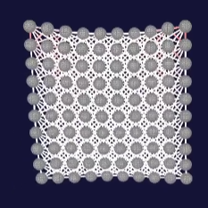

# 🧵 Simulación de Tela con Position-Based Dynamics (PBD) en Processing

  

## 📌 Descripción  

Este proyecto implementa una simulación de tela utilizando **Position-Based Dynamics (PBD)** en Processing.  
El objetivo es estudiar distintos tipos de restricciones físicas aplicadas a una malla de partículas para comprender:  
- Qué tipos de restricciones existen.  
- Qué hace cada una.  
- Para qué sirven en simulaciones físicas.  
- Cómo influye el parámetro **stiffness** en la simulación.  

El proyecto es una herramienta visual que permite experimentar con cada restricción y observar su efecto en tiempo real.  

---

## 🚀 Tecnologías utilizadas  

- **Lenguaje:** Java (Processing)  
- **Framework:** Processing  
- **Técnica principal:** Position-Based Dynamics (PBD)  

---

## 🧩 Tipos de restricciones implementadas  

1. **Distance Constraint**  
   - Mantiene una distancia fija entre dos partículas.  
   - Simula elasticidad y rigidez básica de la tela.  

2. **Triangle Constraint**  
   - Mantiene la forma de un triángulo formado por tres partículas.  
   - Ayuda a mantener la estabilidad y evitar deformaciones excesivas.  

3. **Bending Constraint**  
   - Mantiene un ángulo constante entre partículas conectadas.  
   - Simula resistencia al doblado o curvatura, esencial para realismo en telas.  

---

## 🔧 Parámetro: Stiffness  

- Representa la **rigidez** de la restricción.  
- Valores cercanos a 1 → restricción muy fuerte (menos deformaciones).  
- Valores bajos → restricción más flexible (más deformaciones).  
- Controlar stiffness permite balancear entre realismo y estabilidad computacional.  

---

## 🖼️ Captura de ejemplo  

  

---

## 👤 Autor  

- [Enrique Morcillo Martínez](https://github.com/kitex03)  

---

## ✨ Aprendizajes  

- Comprensión profunda de **Position-Based Dynamics (PBD)**.  
- Experimento con distintas restricciones y análisis de sus efectos.  
- Importancia del parámetro stiffness en simulaciones físicas.  
- Creación de simulaciones interactivas en Processing.  

